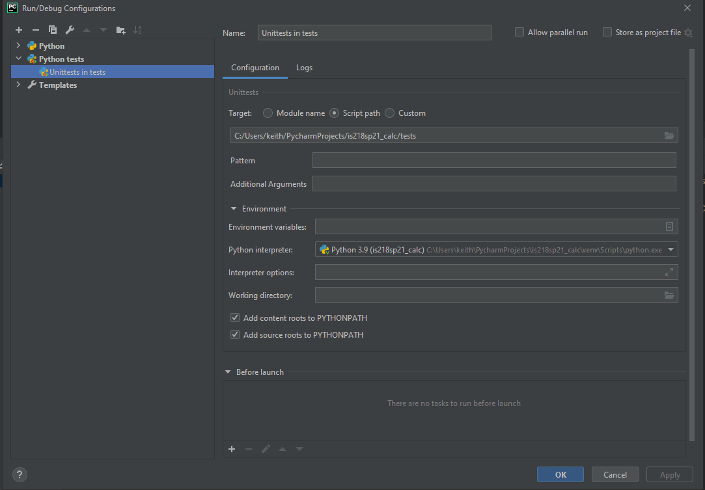

# Command to run tests without coverage

python -m unittest discover tests

note - "discover tests" is telling python to find the tests in the tests directory

# Command to run tests with coverage
coverage run -m unittest discover tests
[Coverage Docs](https://coverage.readthedocs.io/en/latest/)

# Pycharm Unit Test Run Config

# Notes

1.  [You need to signup for github student account pack](https://education.github.com/pack)
2.  [You need to signup for travis pro](https://travis-ci.com/)
3.  [you need to signup for coveralls](https://coveralls.io/)

Note: you will need to enable the repo on coveralls and change the readme to use the travis and coveralls links for your repo.  Remember you need to sync the repos on coveralls to see new repo.  You need to also put the coverall config in .coverall.yml
DO NOT PAY FOR ANYTHING!  That is what the github student developer pack helps with 

The student github pack gives you access to travis pro 